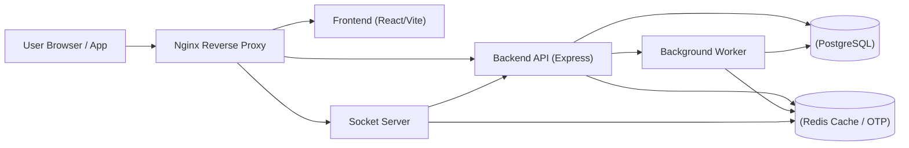
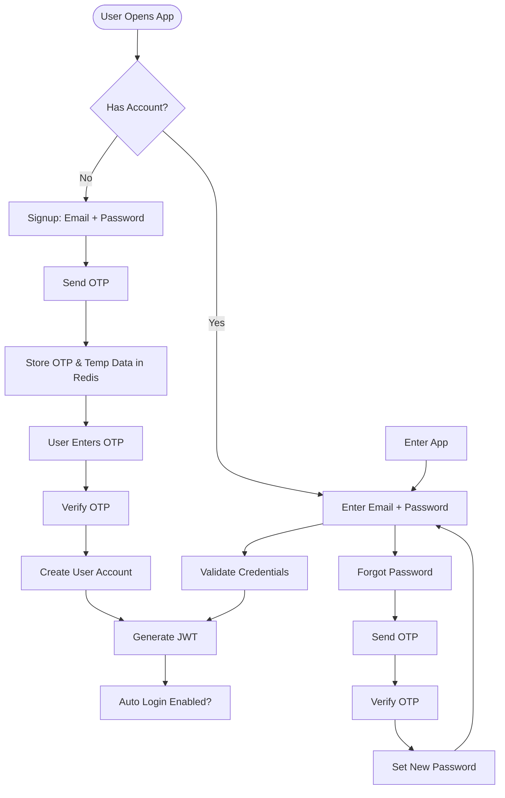
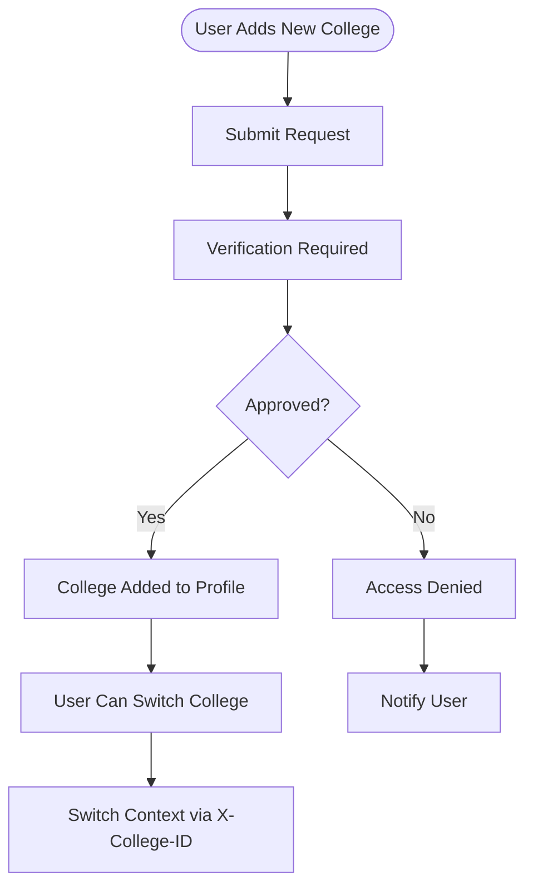
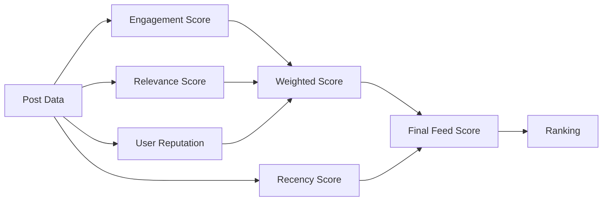

# Allumnova Architecture Documentation

This document describes the high-level architecture of the Allumnova platform, representing the system components and their interactions.

## Architecture Diagram



## Component Overview

### 1. Nginx Reverse Proxy
Acts as the entry point for all incoming traffic. Routes requests based on the URL path:
- `/` -> **Frontend**
- `/api` -> **Backend API**
- `/socket.io` -> **Socket Server**

### 2. Frontend (React/Vite)
A modern SPA built with React and Vite. It communicates with the Backend API for data and the Socket Server for real-time updates.

### 3. Backend API (Express)
The core REST API built with Node.js and Express. It handles business logic, authentication, and database operations. It also interacts with the Redis cache and offloads long-running tasks to the Background Worker.

### 4. Socket Server
Dedicated service for real-time bidirectional communication using Socket.io. It handles live notifications, messaging, and presence indicators.

### 5. Background Worker
Uses BullMQ with Redis to process asynchronous tasks like sending emails, processing uploads, or heavy background computations.

## Authentication Flow

This section illustrates the multi-stage authentication process for Signup, Login, and Password Reset.



## Data Lifecycle

- **Signup Data**: Cached in Redis for 15 minutes. Record is created in PostgreSQL only after OTP verification.
- **OTP**: Stored in Redis with 5-minute expiration.
- **JWT**: Issued for 24 hours.

### 6. PostgreSQL (Database)
The primary relational database for persistent storage of users, posts, and system data. Managed using Prisma ORM.

### 7. Redis (Cache / OTP)
Memory-based data store used for:
- Session caching
- OTP (One-Time Password) storage
- Message queueing (BullMQ)
## Multi-College Adding Flow

Users can join multiple colleges, subject to verification and approval.



## Feed Algorithm

The platform uses a weighted ranking algorithm to provide a personalized and dynamic feed per college.

### Scoring Logic
The platform uses a modular ranking system calculating four independent scores:

1. **Engagement Score**: Weighted interactions (`Boost: 5, Discuss: 2, Appreciate: 1`).
2. **Relevance Score**: Weighted by post type (`Opportunity: 3, Achievement: 2`) and a **+5 bonus** for posts from accepted connections.
3. **User Reputation**: 10% of the author's global reputation score.
4. **Recency Score**: Time decay using gravity (`1 / (Hours + 2)^1.8`).

```
Weighted Score = (Engagement + Relevance + Reputation)
Final Feed Score = Weighted Score * Recency Score
```



### Performance Strategy (Redis)
1. **Sorted Sets**: Post IDs are stored in Redis Sorted Sets (`feed:college:{id}`) with their engagement scores as the rank.
2. **Real-time Updates**: Every interaction (Appreciate, Discuss, Boost) triggers a background re-calculation of the post's score and updates the Redis ranking.
3. **Hydration**: The API fetches top IDs from Redis and hydrates full post objects from PostgreSQL.

```mermaid
flowchart TD
    Request[Request Feed] --> CacheCheck{Redis Cache Hit?}
    CacheCheck -- Yes --> Hydrate[Fetch Post Details from DB]
    CacheCheck -- No --> DBFetch[Calculate Scores in DB]
    DBFetch --> CacheSet[Store Scores in Redis]
    CacheSet --> Hydrate
    ## Interaction Flow

The platform supports high-engagement real-time interactions including Appreciations, Discussions, Connection requests, and Content Boosting.

### Persistent Event Cycle
Every user action follows a standardized pipeline to ensure data persistence and real-time feedback:

1. **User Action**: Client sends an interaction request (e.g., `POST /api/feed/:postId/interact`).
2. **Action Type Processing**:
    - **Appreciate**: Increments interaction count.
    - **Discuss**: Adds a comment/discussion entry.
    - **Connect**: Creates a `Connection` record in `pending` state.
    - **Boost**: Significantly increases the post's visibility score.
3. **Database Storage**: The action is persisted in PostgreSQL.
4. **Create Notification Record**: 
    - A new `Notification` entry is created in the database, linked to the target user, with a `contextId` (e.g., postId).
5. **Socket Signaling**: 
    - Real-time events are emitted via Socket.io (`notification`, `new_post`, `ranking_update`).
6. **Frontend Experience**:
    - The client shows a real-time toast/badge.
    - The user can click the notification to be redirected to the specific context (Post, Profile, or Chat).
7. **Feed Ranking Update**: 
    - The `feed:college:{id}` sorted set in Redis is updated to reflect the new engagement score.

```mermaid
flowchart TD
    Action[User Action] --> Type{Action Type}
    Type -- Appreciate --> Inc[Increment Count]
    Type -- Discuss --> Comm[Add Comment]
    Type -- Connect --> Conn[Create Connection Request]
    Type -- Boost --> Vis[Increase Visibility Score]
    
    Inc & Comm & Conn & Vis --> DB[(Store in DB)]
    DB --> Record[Create Persistent Notification]
    Record --> Socket[Push via Socket]
    Socket --> UI[Frontend Alert]
    UI --> Click[User Clicks]
    Click --> Redirect[Redirect to Context]
```
