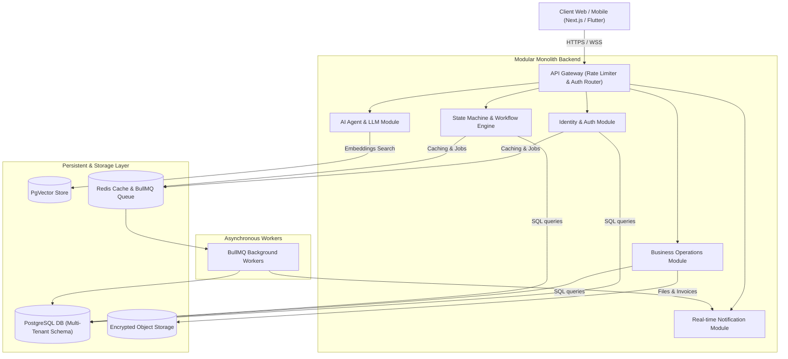

# System Solution Document (SSD) — B2B Enterprise OS
**Version:** 1.0.0  
**Author:** Chief Technology Officer (CTO) Office  
**Date:** June 2026

---

## 1. High-Level Architecture Overview

The B2B Enterprise OS is structured as a **Modular Monolith** designed for deployment simplicity, which can scale into independent **Microservices** as domains grow.

### 1.1 Architecture Diagram

---

## 2. Architecture Styles & Design Patterns

### 2.1 Domain-Driven Design (DDD)
The codebase is structured into isolated domains called **Modules**. Each module contains its own routes, controller, services, and models, interacting with other domains strictly via well-defined API boundaries or internal pub/sub events.

### 2.2 Event-Driven Architecture (EDA)
Processes that do not require synchronous responses (e.g., sending notification emails, creating invoices, running AI text parsing) are processed via BullMQ queues backed by Redis.

### 2.3 Multi-Tenant Strategy
The platform supports multi-tenancy using **Logical Schema Isolation** or **Shared Database with Tenant Partitioning**:
- Every table contains an `organizationId` or `tenantId` field.
- Database access queries are automatically scoped by organization ID using middleware, preventing tenant data leakage.

### 2.4 Modular Monolith to Microservices Evolution
To prevent premature optimization, all modules live in a single repository. If a module (e.g., the AI Agent System or Workflow State Machine) experiences heavy workloads, it can be split into a separate service running in its own container, using the shared database or communicating via gRPC.

---

## 3. Client & Internal Platform Layout

### 3.1 Client Workspace Web portal (Next.js)
- Server-Side Rendered (SSR) login and landing pages.
- Client-Side routing for workspaces: Dashboard, Requirement Engine, Proposals list, Payments, Support Desk.
- State management utilizing React Query for automatic caching and pagination.

### 3.2 Internal Workspace
- Staff CRM, Task Boards, HR Payroll, Developer Console.
- Built-in live telemetry to track active tasks, SLAs, and database loads.

---

## 4. Integration Matrix

The system includes pre-built drivers inside the `Integration Service` supporting:
- **Communications**: Twilio SMS, SendGrid Email, WhatsApp Business.
- **Payments**: Stripe Billing, Razorpay, Invoice auto-generation.
- **Documents**: Adobe Sign / DocuSign equivalent, cryptographic PDF signing.
- **Storage**: AWS S3, Google Cloud Storage.
